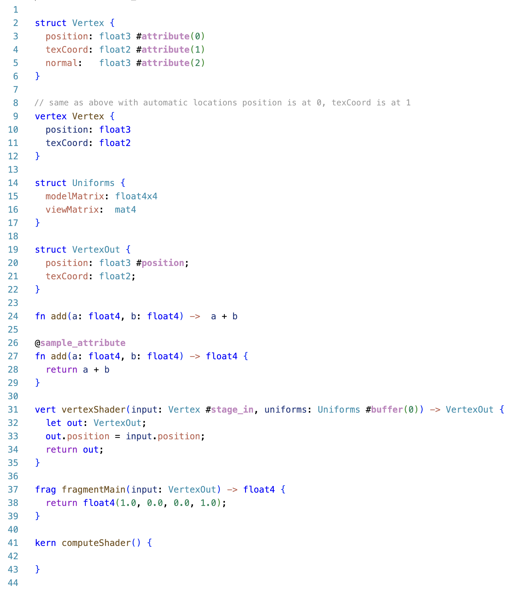

# Universal Shading Language (USL) - WIP

VS Code extension for Universal Shading Language with comprehensive syntax highlighting, IntelliSense, and language support.

The compiler still is in WIP, for more information see https://github.com/UniversalShading



## Features

- **Syntax Highlighting**
- **IntelliSense Auto-completion**
- more as TODO

## Font Ligatures (Optional)

For a better experience with operators like `->`, enable font ligatures:

1. Install a font with ligature support (e.g., [Fira Code](https://github.com/tonsky/FiraCode), [JetBrains Mono](https://www.jetbrains.com/lp/mono/))
2. Add to your VS Code `settings.json`:
   ```json
   {
     "editor.fontFamily": "Fira Code",
     "editor.fontLigatures": true
   }
   ```

## Links

- [GitHub Repository](https://github.com/UniversalShading/vscode-ext)
- [Universal Shading Language](https://github.com/UniversalShading)
